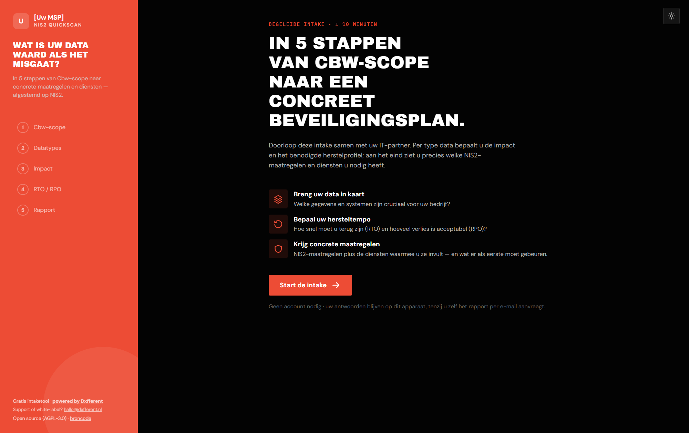
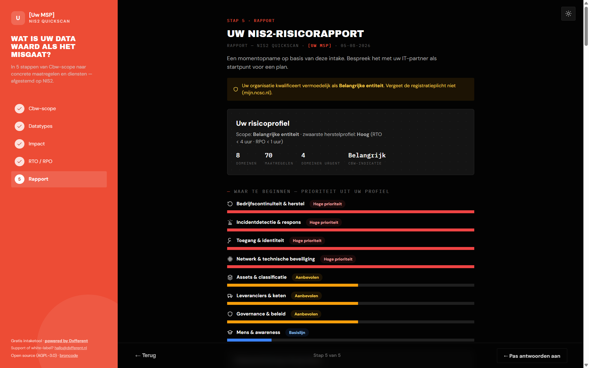

# NIS2 Quickscan — gratis risico-intake voor de Cyberbeveiligingswet

[](LICENSE)
[](https://github.com/Dxfferent/nis2-quickscan/actions/workflows/ci.yml)
[](https://github.com/Dxfferent/nis2-quickscan/releases)
[](CONTRIBUTING.md)

**[White-label voor uw MSP](docs/MSP-ENABLEMENT.md)** ·
**[Zelf hosten](docs/HOSTING.md)** ·
**[Claude-skills](skills/README.md)** ·
**[Releases](../../releases)** ·
**[Wijzigingen](CHANGELOG.md)**

**Open-source NIS2-check voor Nederlandse organisaties en MSP's.** In vijf
(leadmagnet) of zes (pro) begeleide stappen van Cbw-scope-indicatie naar
RTO/RPO-herstelprofielen en een gap-overzicht over 78 maatregelen uit
het Cbw (NIS2) Control Framework en NIS2 Supply Chain (voorheen NIS2
Kwaliteitsmerk). Volledig
statisch (geen backend, geen account); antwoorden blijven op het apparaat —
alleen wie in de lead-stand zelf het rapport aanvraagt, stuurt zijn
e-mailadres en een rapport-samenvatting naar het CRM van de aanbiedende
partij.
White-label inzetbaar door elke MSP.

> **Voor MSP's: eigen huisstijl in vijf minuten.** Naam, logo, kleuren, thema en
> uw eigen leadflow via één configblok, zonder rebuild — zie
> [docs/MSP-ENABLEMENT.md](docs/MSP-ENABLEMENT.md).





> *Free, open-source NIS2 / Cyberbeveiligingswet self-assessment for the
> Dutch market: scope check, RTO/RPO recovery profiles and a prioritised
> gap overview across 78 controls. Static site, white-label ready for MSPs.
> Built by [Dxfferent](https://dxfferent.nl).*

## Wat de intake doet

1. **Cbw-scope in kaart** — sector (bijlage 1/2), omvang en
   van-rechtswege-categorieën → indicatie *essentieel / belangrijk / indirect
   geraakt via de keten / buiten scope*, met doorverwijzing naar de officiële
   [RDI-zelfevaluatie](https://regelhulpenvoorbedrijven.nl/NIS-2-NL).
2. **Risicoprofiel per datatype** — impact en veranderfrequentie per systeem
   → concrete RTO/RPO-herstelprofielen.
3. **Volwassenheid per maatregel** — 5 niveaus, van "niets geregeld" tot
   "aantoonbaar op orde".
4. **Wat er moet gebeuren** — het gap-overzicht per domein, met per maatregel
   het soort werk (techniek · beleid & procedures · mens & organisatie ·
   toetsing & bewijs) en de telling als kop: zo is direct zichtbaar dat het
   merendeel geen techniek is maar aantoonbaarheid. Filterbaar op
   Cbw-verplicht, doorzoekbaar op letterlijke artikelcodes; in de pro-stand
   draagt elke maatregel het MSP-werkpakket dat hem afdekt. Inclusief
   meldplicht-tijdlijn (24u / 72u / eindverslag).

   > De 78 maatregelen clusteren in **25 MSP-werkpakketten** — herkenbare
   > brokken werk als *Managed back-up* of *Monitoring & detectie (SOC/SIEM)*,
   > bedoeld als denkraam voor het gesprek met de klant. In de data zijn dat
   > `domains[].themes[]` in `assets/intake-config.json`; elke maatregel wijst
   > er via `theme` naar. De 78 `service`-waarden zijn de laag eronder
   > (dienstnaam per maatregel), de menukaart in `package_suggestion` de laag
   > erboven (verkoopregels per SC-niveau).
5. **Ambitieniveau en menukaart** — een matrix van diensten × de drie
   SC-niveaus (SC-10 / SC-20 / SC-30) met het geadviseerde niveau uitgelicht,
   afgeleid uit scope-uitkomst en herstelprofiel. Elke dienstregel draagt het
   Cbw-artikel dat ze raakt. White-label vervangbaar door de eigen menukaart
   (`MSP_BRAND.packages`).

## Twee standen: leadmagnet én consultant-gereedschap

Dezelfde tool, twee inzetten — gekozen via `?mode=` in de URL (of
`MSP_BRAND.mode`):

| | `?mode=lead` (default) | `?mode=pro` |
|---|---|---|
| Voor | bezoekers van uw site | uw eigen consultants |
| Stappen | 5 — zonder maatregelen in te vullen | 6 — volledige volwassenheidsmeting |
| Rapport | achter lead-gate (lead in uw CRM) | direct, nooit een gate |
| Dossier | — | opslaan/laden als `.json` (QBR-hermeting) |

Beide standen bewaren de voortgang automatisch op het apparaat
(localStorage) — een gesloten tabblad verliest niets. De pro-stand is het
werkinstrument (klant aan tafel, dossier per klant); de lead-stand is de
vanger op uw site.

## Snel starten

**Zonder ontwikkelomgeving:** download de zip bij de laatste
[release](../../releases), pak uit, zet uw `MSP_BRAND`-blok in `index.html` en
upload de bestanden naar uw webhosting. Geen Node, geen terminal. Let op:
dubbelklikken op `index.html` werkt niet — de tool heeft een webserver nodig.
De skill [`skills/nis2-installatie/`](skills/nis2-installatie/) loopt het met u
door.

**Met Node:**

```bash
npm install
npm run build        # → dist/ — statisch, self-contained, geen CDN
```

Host `dist/` op elke webserver of CDN. Lokaal proberen zonder build:
`python -m http.server 8123` in de repo-root → http://localhost:8123/. Dat is de
**dev-variant**: die laadt React en Babel van unpkg en hoort niet gehost te
worden — publiceer altijd `dist/`, dat is self-contained en zonder CDN. Zie [docs/HOSTING.md](docs/HOSTING.md) voor
lead-gate (HubSpot), nginx-voorbeeld en cache-regels.

## White-label voor MSP's

Eén config-blok — eigen naam, logo, kleuren, thema en leadflow, zonder
rebuild:

```html
<script>
window.MSP_BRAND = {
  name: 'Acme IT',
  logo: '/acme-logo.svg',
  accent: '#0d9488',
  theme: 'dark',
  tokens: { '--bg-canvas': '#0b1220' },
  mailto: 'security@acme-it.example',
  privacyUrl: 'https://acme-it.example/privacy', // vereist zodra u een gate draait
  legal: 'Acme IT B.V. · KvK 12345678 · Straat 1, 1234 AB Plaats',
  hubspot: { portalId: '…', formId: '…' },   // leads landen bij de MSP
};
</script>
```

Volledige uitleg: [docs/MSP-ENABLEMENT.md](docs/MSP-ENABLEMENT.md). Vier
dingen blijven in elke variant staan (voorwaarden, zie
[ATTRIBUTION.md](ATTRIBUTION.md)): de bronvermelding, *powered by Dxfferent*,
de disclaimer en de broncode-link die AGPL-3.0 §13 vereist — wijzigt u de
code, dan wijst die link naar uw eigen bron. Support of white-label-hulp:
**hallo@dxfferent.nl**.

## Claude-skills voor MSP's

`skills/` bevat zes zelfstandige [Claude-skills](skills/README.md):
installatie- en CRM-koppelingsbegeleiding voor de tool zelf, plus
Cbw-scope-check, meldplicht-coach, rapport-naar-voorstel-adviseur en
MSP go-to-market op hetzelfde kennisniveau als de tool. Kopieer ze naar
`.claude/skills/` en voer NIS2-gesprekken met dezelfde normbasis.

## Bronnen & betrouwbaarheid

Gebouwd op de bron, niet op een blog: gegenereerd uit het **Cbw (NIS2)
Control Framework v1.2** (ADR & NOREA, CC BY 4.0 — bewerkt door Dxfferent
B.V.), met maatregel-titelverwijzingen naar de norm **NIS2 Supply Chain**
(voorheen NIS2 Kwaliteitsmerk; Stichting Kwaliteitsinnovatie). Dxfferent B.V. en deze tool zijn niet
verbonden aan, gecertificeerd door of goedgekeurd door Stichting
Kwaliteitsinnovatie; de intake is geen certificeringsinstrument en het
doorlopen ervan levert geen keurmerk-certificaat op. Wet vastgesteld en
gepubliceerd als Cyberbeveiligingswet (Stb. 2026, 187), met het
Cyberbeveiligingsbesluit
(Stb. 2026, 189); beide in werking 15 augustus 2026.
Volledige bronvermelding: [ATTRIBUTION.md](ATTRIBUTION.md). Dxfferent
streeft ernaar normdata-updates bij wetswijzigingen te publiceren als nieuwe
`assets/intake-config.json` — een config-swap, geen rebuild — vrijblijvend
en zonder daartoe verplicht te zijn.

`assets/intake-config.json` in deze repository **is** de normdata: er is geen
verborgen backend die hem aanlevert en geen build-stap die hem genereert. Wie
de tool forkt, bewerkt dit bestand rechtstreeks — alle 78 maatregelen, de
scope-check en de menukaart staan erin. De structuur is gedocumenteerd in
[docs/MSP-ENABLEMENT.md](docs/MSP-ENABLEMENT.md); `tests/engine-smoke.mjs`
bewaakt de invarianten en draait in CI.

**Disclaimer:** dit is een gratis hulpmiddel. Uitkomsten zijn indicatief en
geautomatiseerd gegenereerd op basis van de stand van wet- en regelgeving
ten tijde van de in het rapport vermelde normdata-versie; latere wijzigingen
(waaronder ministeriële regelingen) kunnen de uitkomst achterhalen. Aan de
uitkomsten kunnen geen rechten worden ontleend en er wordt geen garantie
gegeven op juistheid, volledigheid of actualiteit. Voor zover wettelijk
toegestaan aanvaarden Dxfferent en de aanbiedende partner geen
aansprakelijkheid voor schade door gebruik van dit hulpmiddel, behoudens
opzet of bewuste roekeloosheid. Controleer de uitkomst altijd zelf tegen de
officiële bronnen (RDI-zelfevaluatie, wettekst) en win waar nodig
professioneel advies in. Dit is geen juridisch advies.

## Veelgestelde vragen

**Valt mijn organisatie onder NIS2 / de Cyberbeveiligingswet?**
Doorloop stap 1 van de intake voor een snelle indicatie op sector, omvang en
van-rechtswege-categorieën. De wettekst is bepalend; de RDI-zelfevaluatie is
het officiële hulpmiddel om uw classificatie vast te stellen.

**Wat is het verschil tussen essentieel en belangrijk?**
Bijlage-1-sector + grote onderneming → essentieel; overige in-scope
organisaties → belangrijk. Het verschil zit in toezicht en sancties; de
zorgplicht-maatregelen zijn grotendeels gelijk.

**Wat zijn RTO en RPO?**
RTO (Recovery Time Objective) = hoe snel een systeem terug moet zijn; RPO
(Recovery Point Objective) = hoeveel dataverlies acceptabel is. De intake
leidt beide per datatype af uit impact en veranderfrequentie.

**Waar meld ik een incident?**
Bij het meldpunt van het NCSC: mijn.ncsc.nl — eerste melding binnen 24 uur,
incidentmelding binnen 72 uur, eindverslag binnen een maand. De intake bevat
de volledige tijdlijn inclusief uitzonderingen.

**Is dit gratis, ook commercieel?**
Ja — AGPL-3.0-licentie: vrij te gebruiken, aan te passen en white-label in
te zetten, ook commercieel. Wie een aangepaste versie verspreidt of publiek
host, deelt die aanpassingen onder dezelfde licentie terug; doorverkoop als
gesloten product kan dus niet. Zie [ATTRIBUTION.md](ATTRIBUTION.md).

## Over Dxfferent

[Dxfferent](https://dxfferent.nl) is de gids in MSP-ondernemerschap. Wij
helpen MSP's hun bedrijf voorspelbaar, winstgevend en audit-proof te maken —
procesoptimalisatie, ISO 27001- en NIS2/Cbw-implementaties, Security
Officer-training en vCISO-invulling — en we volgen de consoliderende
MSP-markt met een redactioneel marktregister. Deze quickscan hoort bij dat
verhaal: in een consoliderende markt is aantoonbare compliance mede bepalend
voor de waarde van een MSP, en via het white-label-partnermodel voert u er
het NIS2-gesprek met uw klanten mee — op dezelfde lijn als alles wat we
publiceren: geen claim zonder bron. Vragen, support of samenwerken:
**hallo@dxfferent.nl**.

## Bijdragen

Issues en PR's welkom — zie [CONTRIBUTING.md](CONTRIBUTING.md).
Beveiligingsissues: [SECURITY.md](SECURITY.md).

## Licentie

Code: [AGPL-3.0](LICENSE) © 2026 Dxfferent B.V., met aanvullende
attributie-voorwaarden (AGPL-3.0 §7(b)) — vrij gebruik en aanpassing, wijzigingen
delen onder dezelfde licentie, bronvermeldingen blijven staan. Normdata en
voorwaarden: [ATTRIBUTION.md](ATTRIBUTION.md). Naam en logo vallen niet
onder de licentie: [TRADEMARK.md](TRADEMARK.md). Gebruiksvoorwaarden en
reikwijdte van de uitkomsten: [DISCLAIMER.md](DISCLAIMER.md).
